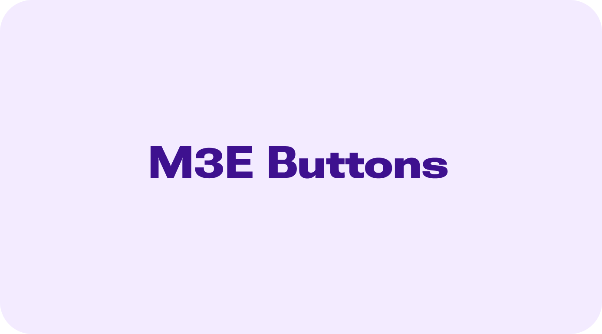
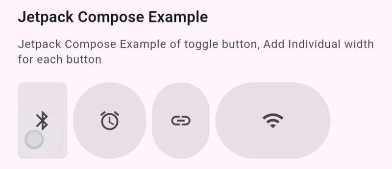
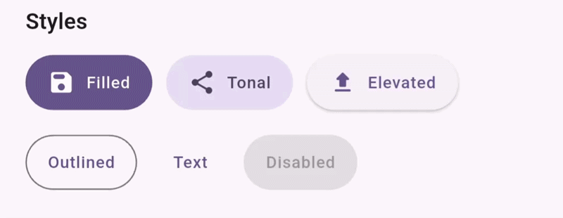
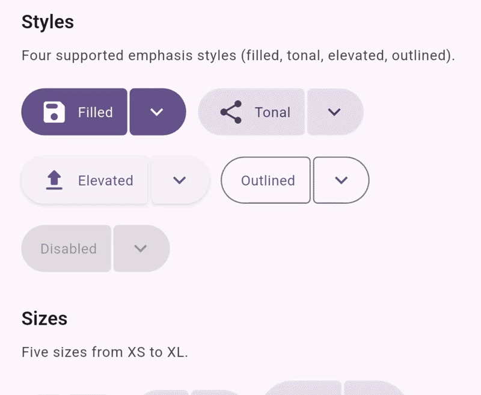
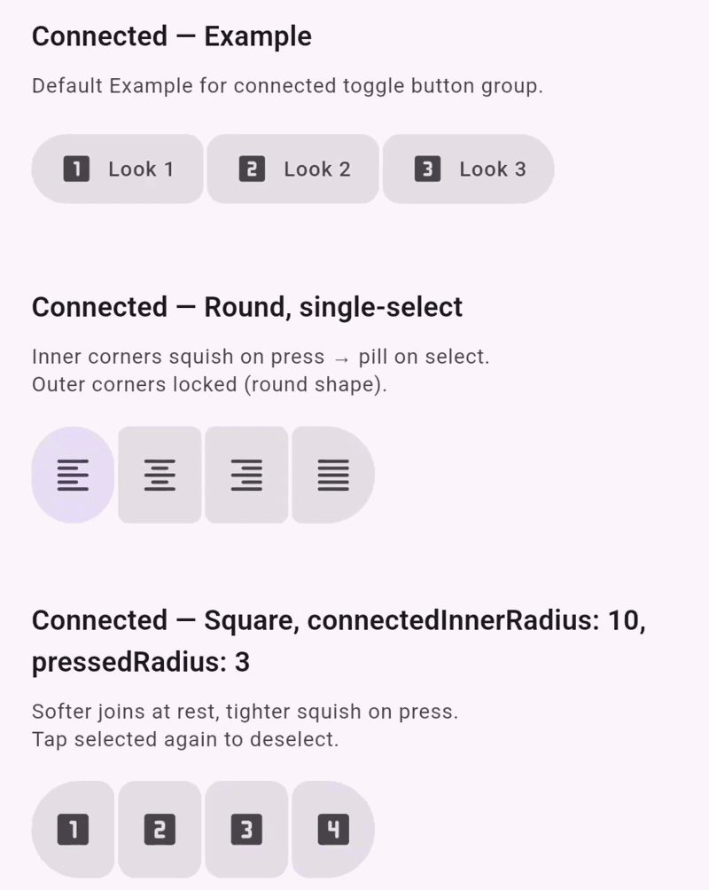
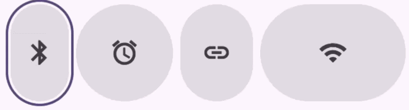
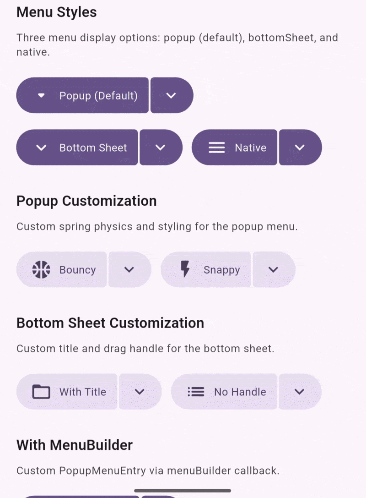
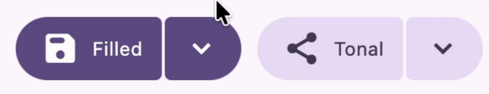
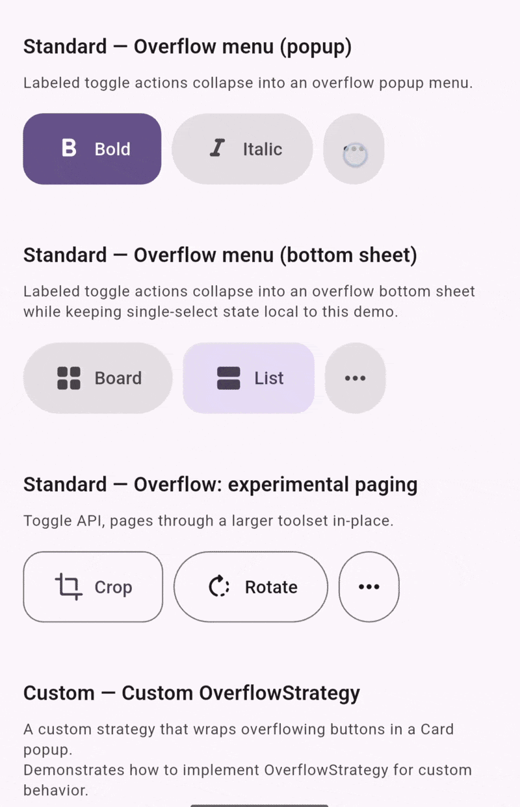
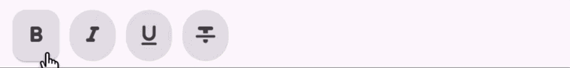

# m3e_buttons

[](https://flutter.dev)
[](https://pub.dev/packages/m3e_buttons)
[](LICENSE)
[](https://m3.material.io/styles/motion/easing-and-duration/applying-easing-and-duration)



> **Buttons the way they were meant to feel.** Spring physics. Shape morphing. Five styles, five sizes, zero compromises.

Inspired by the [Jetpack Compose](https://developer.android.com/jetpack/compose) implementation of **Material 3 Expressive**, `m3e_buttons` brings spring-driven shape animations, a rich customization model, and tactile responsiveness to Flutter — without writing a single line of animation code yourself.

**Live example:** [mudit200408.github.io/m3e_core](https://mudit200408.github.io/m3e_core/)



---

> [!WARNING]
> **Breaking changes in v0.0.2** — If you are upgrading from v0.0.1, please read the [Migration Guide](#migration-from-v001-to-v002) before updating. Several parameters have been renamed, removed, or replaced with `WidgetStateProperty`-based equivalents. Component class names have also changed.

---

## Table of Contents

- [Why m3e_buttons?](#why-m3e_buttons)
- [Screenshots](#screenshots)
- [Installation](#installation)
- [Quick Start](#quick-start)
- [Migration from v0.0.1 to v0.0.2](#migration-from-v001-to-v002)
- [Drop-in Flutter Replacement](#drop-in-flutter-replacement)
- [Components](#components)
  - [M3EButton](#m3ebutton)
  - [M3EToggleButton](#m3etogglebutton)
  - [M3EToggleButtonGroup](#m3etogglebuttongroup)
  - [M3ESplitButton](#m3esplitbutton)
- [Decoration System](#decoration-system)
- [Enums & Tokens](#enums--tokens)
- [Motion System](#motion-system)
- [Accessibility](#accessibility)
- [Architecture](#architecture)

---

## Why m3e_buttons?

Flutter's built-in buttons don't animate their shape on press. Material 3 Expressive changes that with spring-physics-based radius squish on press, expansion on hover, and shape morphing for toggle state. `m3e_buttons` implements all of this faithfully in pure Flutter.

- **Localized rebuilds** — Interaction-driven animations use `ValueNotifier` patterns so only the affected widget rebuilds on hover or press.
- **Spring animations** — Radius, padding, and focus rings all use `motor`-backed spring physics.
- **Five styles** — `filled`, `tonal`, `elevated`, `outlined`, `text`.
- **Five size presets** — `xs`, `sm`, `md`, `lg`, `xl` — plus `M3EButtonSize.custom(...)`.
- **Toggle buttons** — Icon/label swap animations with expressive checked-state shape morphing.
- **Connected toggle groups** — Neighbor-squish, single- and multi-select, overflow handling.
- **Split buttons** — Dual-segment with popup, bottom sheet, or custom menu.
- **Decoration-based styling** — One `M3EButtonDecoration` controls everything. No `ButtonStyle` juggling.
- **Haptic feedback** — Four levels, baked into the decoration model.

---

## Screenshots

| Button | Split Button | Toggle Button Group |
|--------|-------------|-------------------|
|  |  |  |

| Hovered | Focused | Focused Toggle |
|---------|---------|---------------|
|  |  |  |

| Split Button Menu | Hovered Split | Toggle Overflow |
|-------------------|--------------|----------------|
|  |  |  |

---

## Installation

```bash
flutter pub add m3e_buttons
```

Or add manually to `pubspec.yaml`:

```yaml
dependencies:
  m3e_buttons: ^0.0.2
```

```dart
import 'package:m3e_buttons/m3e_buttons.dart';
```

---

## Quick Start

```dart
import 'package:flutter/material.dart';
import 'package:m3e_buttons/m3e_buttons.dart';

class Demo extends StatelessWidget {
  const Demo({super.key});

  @override
  Widget build(BuildContext context) {
    return Column(
      mainAxisSize: MainAxisSize.min,
      children: [
        M3EFilledButton(
          onPressed: () {},
          child: const Text('Save'),
        ),
        const SizedBox(height: 12),
        M3EElevatedToggleButton(
          icon: const Icon(Icons.favorite_border),
          checkedIcon: const Icon(Icons.favorite),
          onCheckedChange: (checked) {},
        ),
        const SizedBox(height: 12),
        M3EFilledSplitButton<String>(
          label: 'Actions',
          leadingIcon: Icons.more_horiz,
          items: const [
            M3ESplitButtonItem(value: 'edit', child: Text('Edit')),
            M3ESplitButtonItem(value: 'share', child: Text('Share')),
          ],
          onSelected: (value) {},
          onPressed: () {},
        ),
      ],
    );
  }
}
```

---

## Migration from v0.0.1 to v0.0.2

> [!CAUTION]
> This release contains breaking API changes. Review each section below before upgrading.

### 1. `WidgetStateProperty` shift

Most color and cursor parameters have transitioned from flat types to `WidgetStateProperty`. Use the `.styleFrom()` helper to pass flat values — it handles the mapping automatically.

```dart
// v0.0.1
M3EButtonDecoration(backgroundColor: Colors.blue)

// v0.0.2
M3EButtonDecoration.styleFrom(backgroundColor: Colors.blue)
```

### 2. Removed parameters

| Parameter | Affected Classes | Migration |
|-----------|-----------------|-----------|
| `size` | All decoration classes | Move `size` to the button widget itself. |
| `disabledBackgroundColor` | All decorations | Use `backgroundColor` with `WidgetStateProperty`. |
| `disabledForegroundColor` | All decorations | Use `foregroundColor` with `WidgetStateProperty`. |
| `connectedHoveredInnerRadius` | `M3EToggleButtonDecoration` | Logic merged into `hoveredRadius`. |
| `connectedPressedInnerRadius` | `M3EToggleButtonDecoration` | Logic merged into `pressedRadius`. |

### 3. Renamed components

| v0.0.1 | v0.0.2 |
|--------|--------|
| `SplitButtonM3E` | `M3ESplitButton` |
| `SplitButtonM3EItem` | `M3ESplitButtonItem` |
| `SplitButtonM3EDecoration` | `M3ESplitButtonDecoration` |

---

## Drop-in Flutter Replacement

For standard action buttons, `m3e_buttons` aligns closely with Flutter's built-in API. Prefix existing class names with `M3E` and you're done — no logic changes required.

| Flutter | M3E Button | M3E Toggle Button | M3E Split Button |
|---------|-----------|-------------------|------------------|
| `FilledButton` | `M3EFilledButton` | `M3EFilledToggleButton` | `M3EFilledSplitButton` |
| `FilledButton.tonal` | `M3EFilledButton.tonal` | `M3EFilledToggleButton.tonal` | `M3EFilledSplitButton.tonal` |
| `ElevatedButton` | `M3EElevatedButton` | `M3EElevatedToggleButton` | `M3EElevatedSplitButton` |
| `OutlinedButton` | `M3EOutlinedButton` | `M3EOutlinedToggleButton` | `M3EOutlinedSplitButton` |
| `TextButton` | `M3ETextButton` | `M3ETextToggleButton` | — *(text not supported)* |

```dart
// Before
ElevatedButton(
  onPressed: () {},
  child: const Text('Click Me'),
)

// After
M3EElevatedButton(
  onPressed: () {},
  child: const Text('Click Me'),
)
```

---

## Components

### `M3EButton`

The standard single-action button. Spring-animated radius squish on press, expansion on hover, and a focus ring that tracks the animated shape.


```dart
M3EButton(
  style: M3EButtonStyle.filled,
  size: M3EButtonSize.md,
  shape: M3EButtonShape.round,
  onPressed: () {},
  child: const Row(
    mainAxisSize: MainAxisSize.min,
    children: [
      Icon(Icons.send),
      SizedBox(width: 8),
      Text('Send'),
    ],
  ),
)
```

> **Tip:** Use `M3EButton.icon(...)` for the standard icon + label layout without manual `Row` wrapping. For common styles, prefer the specialized classes — `M3EFilledButton`, `M3EElevatedButton`, `M3EOutlinedButton`, `M3ETextButton` — for a cleaner API.

#### Specialized Subclasses

All four style variants are available as dedicated classes — identical API, just with `style` pre-wired:

```dart
// Instead of:
M3EButton(style: M3EButtonStyle.elevated, onPressed: () {}, child: const Text('Upload'))

// Use:
M3EElevatedButton(onPressed: () {}, child: const Text('Upload'))
```

#### Parameters

| Parameter | Type | Default | Description |
|-----------|------|---------|-------------|
| `onPressed` | `VoidCallback?` | **required** | Tap callback. `null` disables the button. |
| `child` | `Widget?` | `null` | Primary content. |
| `style` | `M3EButtonStyle` | `filled` | Visual style. |
| `size` | `M3EButtonSize` | `sm` | Size preset. Overridden by `decoration.fixedSize`. |
| `shape` | `M3EButtonShape` | `round` | Corner radius strategy. |
| `enabled` | `bool` | `true` | Disables without removing from the tree. |
| `decoration` | `M3EButtonDecoration?` | `null` | Colors, radius, motion, haptics. |
| `focusNode` | `FocusNode?` | `null` | External focus node. |
| `autofocus` | `bool` | `false` | Focus on mount. |
| `onFocusChange` | `ValueChanged<bool>?` | `null` | Focus change callback. |
| `semanticLabel` | `String?` | `null` | Accessibility label. |
| `tooltip` | `String?` | `null` | Hover hint shown after delay. |
| `mouseCursor` | `MouseCursor` | `SystemMouseCursors.click` | Cursor on hover. |
| `onLongPress` | `VoidCallback?` | `null` | Long-press callback. |
| `onHover` | `ValueChanged<bool>?` | `null` | Hover change callback. |
| `enableFeedback` | `bool` | `true` | Ripple and native haptic. |
| `splashFactory` | `InteractiveInkFeatureFactory?` | `InkRipple.splashFactory` | Custom splash factory. |
| `statesController` | `WidgetStatesController?` | `null` | Programmatic state control. |

---

### `M3EToggleButton`

A stateful toggle with shape morphing between unchecked (round) and checked (square) states. Supports icon-only, icon + label, or label-only content with smooth animated label transitions.



```dart
M3EToggleButton(
  icon: const Icon(Icons.bookmark_border),
  checkedIcon: const Icon(Icons.bookmark),
  label: const Text('Save'),
  checkedLabel: const Text('Saved'),
  decoration: const M3EToggleButtonDecoration(
    haptic: M3EHapticFeedback.light,
    motion: M3EMotion.expressiveSpatialDefault,
  ),
  onCheckedChange: (checked) {},
)
```

#### Specialized Subclasses

All five style variants are available as dedicated classes — identical API to `M3EToggleButton`, with `style` pre-wired:

| Class | Style |
|-------|-------|
| `M3EFilledToggleButton` | `M3EButtonStyle.filled` |
| `M3EFilledToggleButton.tonal` | `M3EButtonStyle.tonal` |
| `M3EElevatedToggleButton` | `M3EButtonStyle.elevated` |
| `M3EOutlinedToggleButton` | `M3EButtonStyle.outlined` |
| `M3ETextToggleButton` | `M3EButtonStyle.text` |

```dart
// Instead of:
M3EToggleButton(style: M3EButtonStyle.outlined, onCheckedChange: (v) {}, icon: const Icon(Icons.star_border))

// Use:
M3EOutlinedToggleButton(onCheckedChange: (v) {}, icon: const Icon(Icons.star_border))
```

#### Parameters

| Parameter | Type | Default | Description |
|-----------|------|---------|-------------|
| `onCheckedChange` | `ValueChanged<bool>` | **required** | Called on toggle. |
| `icon` | `Widget?` | `null` | Unchecked icon. |
| `checkedIcon` | `Widget?` | `null` | Checked icon. Falls back to `icon`. |
| `label` | `Widget?` | `null` | Text label (makes button content-width). |
| `checkedLabel` | `Widget?` | `null` | Checked label. Falls back to `label`. |
| `checked` | `bool?` | `null` | External state. `null` = internal management. |
| `style` | `M3EButtonStyle` | `filled` | Visual style. |
| `size` | `M3EButtonSize` | `sm` | Size preset. |
| `enabled` | `bool` | `true` | Enables or disables the toggle. |
| `decoration` | `M3EToggleButtonDecoration?` | `null` | Full decoration bundle. |
| `focusNode` | `FocusNode?` | `null` | External focus node. |
| `autofocus` | `bool` | `false` | Focus on mount. |
| `semanticLabel` | `String?` | `null` | Accessibility label. |
| `tooltip` | `String?` | `null` | Hover hint shown after delay. |

---

### `M3EToggleButtonGroup`

A horizontal or vertical row of `M3EToggleButton`s with neighbor-squish animation — pressing a button expands it while compressing its neighbors. Supports single-select, multi-select, connected layout, and overflow handling.


```dart
// Single-select connected group
M3EToggleButtonGroup(
  type: M3EButtonGroupType.connected,
  selectedIndex: _selected,
  onSelectedIndexChanged: (index) => setState(() => _selected = index),
  actions: const [
    M3EToggleButtonGroupAction(icon: Icon(Icons.format_bold), semanticLabel: 'Bold'),
    M3EToggleButtonGroupAction(icon: Icon(Icons.format_italic), semanticLabel: 'Italic'),
    M3EToggleButtonGroupAction(icon: Icon(Icons.format_underline), semanticLabel: 'Underline'),
  ],
)

// Multi-select with labels
M3EToggleButtonGroup(
  selectedIndices: _selectedIndices,
  onSelectedIndicesChanged: (indices) => setState(() => _selectedIndices = indices),
  size: M3EButtonSize.md,
  actions: [
    M3EToggleButtonGroupAction(icon: const Icon(Icons.music_note), label: const Text('Music')),
    M3EToggleButtonGroupAction(icon: const Icon(Icons.movie), label: const Text('Movies')),
    M3EToggleButtonGroupAction(icon: const Icon(Icons.book), label: const Text('Books')),
  ],
)
```

#### Parameters

| Parameter | Type | Default | Description |
|-----------|------|---------|-------------|
| `actions` | `List<M3EToggleButtonGroupAction>` | **required** | Buttons in the group. |
| `type` | `M3EButtonGroupType` | `standard` | `standard` (gaps) or `connected` (shared edges). |
| `shape` | `M3EButtonShape` | `round` | Corner radius strategy. |
| `size` | `M3EButtonSize` | `sm` | Size preset. |
| `style` | `M3EButtonStyle` | `filled` | Visual style. |
| `density` | `M3EButtonGroupDensity` | `regular` | `regular` or `compact`. |
| `spacing` | `double?` | `null` | Custom gap in dp. Overrides `density`. |
| `direction` | `Axis` | `horizontal` | Layout direction. |
| `selectedIndex` | `int?` | `null` | Controlled single-select state. |
| `selectedIndices` | `Set<int>?` | `null` | Controlled multi-select state. |
| `onSelectedIndexChanged` | `ValueChanged<int?>?` | `null` | Single-select callback. `null` = deselected. |
| `onSelectedIndicesChanged` | `ValueChanged<Set<int>>?` | `null` | Multi-select callback. |
| `neighborSquish` | `bool` | `true` | Neighbor compression on press. |
| `expandedRatio` | `double` | `0.15` | Press expansion factor relative to natural width. |
| `haptic` | `M3EHapticFeedback` | `none` | Group-level haptics. |
| `decoration` | `M3EToggleButtonDecoration?` | `null` | Group-level decoration. Per-action decoration takes precedence. |
| `semanticLabel` | `String?` | `null` | Accessibility label for the group container. |
| `overflow` | `M3EButtonGroupOverflow` | `scroll` | Overflow behavior. |
| `overflowMenuStyle` | `M3EButtonGroupOverflowMenuStyle` | `popup` | `popup` or `bottomSheet`. |

#### `M3EToggleButtonGroupAction`

| Parameter | Type | Default | Description |
|-----------|------|---------|-------------|
| `icon` | `Widget?` | `null` | Unchecked icon. At least `icon` or `label` is required. |
| `checkedIcon` | `Widget?` | `null` | Checked icon. Falls back to `icon`. |
| `label` | `Widget?` | `null` | Text label. |
| `checkedLabel` | `Widget?` | `null` | Checked label. Falls back to `label`. |
| `checked` | `bool?` | `null` | Per-action controlled state. Do not combine with group-level `selectedIndex`. |
| `enabled` | `bool` | `true` | Enables or disables this action. |
| `decoration` | `M3EToggleButtonDecoration?` | `null` | Per-button decoration override. |
| `width` | `double?` | `null` | Fixed width overriding natural content width. |
| `focusNode` | `FocusNode?` | `null` | External focus node. |
| `semanticLabel` | `String?` | `null` | Accessibility label. |
| `tooltip` | `String?` | `null` | Hover hint shown after delay. |

---

### `M3ESplitButton<T>`

A dual-segment button — primary action on the left, chevron-triggered dropdown on the right. The trailing segment morphs to a circle when the menu is open on `md`, `lg`, and `xl` sizes.


```dart
M3ESplitButton<String>(
  label: 'Sort',
  leadingIcon: Icons.sort,
  style: M3EButtonStyle.filled,
  size: M3EButtonSize.md,
  items: const [
    M3ESplitButtonItem(value: 'name', child: Text('By Name')),
    M3ESplitButtonItem(value: 'date', child: Text('By Date')),
    M3ESplitButtonItem(value: 'size', child: Text('By Size')),
  ],
  onSelected: (value) {},
  onPressed: () {},
  leadingTooltip: 'Sort',
  trailingTooltip: 'More sort options',
)
```

> Either `items` or `menuBuilder` must be provided.

#### Specialized Subclasses

Four style variants are available as dedicated classes — identical API to `M3ESplitButton`, with `style` pre-wired. `M3ETextSplitButton` does not exist because `text` style is not supported by split buttons.

| Class | Style |
|-------|-------|
| `M3EFilledSplitButton` | `M3EButtonStyle.filled` |
| `M3EFilledSplitButton.tonal` | `M3EButtonStyle.tonal` |
| `M3EElevatedSplitButton` | `M3EButtonStyle.elevated` |
| `M3EOutlinedSplitButton` | `M3EButtonStyle.outlined` |

```dart
// Instead of:
M3ESplitButton<String>(style: M3EButtonStyle.elevated, items: [...], onSelected: (v) {}, onPressed: () {})

// Use:
M3EElevatedSplitButton<String>(items: [...], onSelected: (v) {}, onPressed: () {})
```

#### Parameters

| Parameter | Type | Default | Description |
|-----------|------|---------|-------------|
| `items` | `List<M3ESplitButtonItem<T>>?` | — | Dropdown menu items. |
| `menuBuilder` | `List<PopupMenuEntry<T>> Function(BuildContext)?` | `null` | Custom menu builder. Overrides `items`. |
| `onSelected` | `ValueChanged<T>?` | `null` | Menu item selection callback. |
| `onPressed` | `VoidCallback?` | `null` | Primary segment tap callback. |
| `label` | `String?` | `null` | Text on the leading segment. |
| `leadingIcon` | `IconData?` | `null` | Leading icon on the primary segment. |
| `size` | `M3EButtonSize` | `sm` | Size preset. Overridden by `decoration.fixedSize`. |
| `shape` | `M3EButtonShape` | `round` | Corner radius strategy. |
| `style` | `M3EButtonStyle` | `filled` | Visual style. `text` is not supported. |
| `trailingAlignment` | `M3ESplitButtonTrailingAlignment` | `opticalCenter` | `opticalCenter` or `geometricCenter`. |
| `leadingTooltip` | `String?` | `null` | Tooltip for the leading segment. |
| `trailingTooltip` | `String?` | `null` | Tooltip for the trailing segment. |
| `enabled` | `bool` | `true` | Disables both segments. |
| `decoration` | `M3ESplitButtonDecoration?` | `null` | Full decoration bundle. |
| `selectedValue` | `T?` | `null` | Currently selected value for menu state display. |

---

## Decoration System

All decoration classes are `@immutable` and support `copyWith`. Pass `null` for any field to use token defaults. Use `.styleFrom()` on any decoration class to pass flat values — `WidgetStateProperty` mapping is handled automatically.

### `M3EButtonDecoration`

```dart
M3EButton(
  decoration: M3EButtonDecoration.styleFrom(
    backgroundColor: Colors.deepPurple,
    foregroundColor: Colors.white,
    motion: M3EMotion.expressiveSpatialFast,
    haptic: M3EHapticFeedback.medium,
    pressedRadius: 8.0,
    hoveredRadius: 20.0,
  ),
  onPressed: () {},
  child: const Text('Custom'),
)
```

| Field | Type | Description |
|-------|------|-------------|
| `backgroundColor` | `WidgetStateProperty<Color?>?` | Button fill. |
| `foregroundColor` | `WidgetStateProperty<Color?>?` | Text and icon color. |
| `shadowColor` | `WidgetStateProperty<Color?>?` | Shadow color. |
| `elevation` | `WidgetStateProperty<double?>?` | Shadow depth. |
| `side` | `WidgetStateProperty<BorderSide?>?` | Custom border. |
| `padding` | `EdgeInsetsGeometry?` | Internal content padding. |
| `minimumSize` | `Size?` | Minimum dimensions. Overrides token `size`. |
| `fixedSize` | `Size?` | Fixed dimensions. Overrides token `size`. |
| `maximumSize` | `Size?` | Maximum dimensions. Overrides token `size`. |
| `textStyle` | `TextStyle?` | Label text style. |
| `iconSize` | `double?` | Leading icon size. |
| `motion` | `M3EMotion?` | Spring physics preset. |
| `haptic` | `M3EHapticFeedback?` | Haptic feedback level. |
| `hoveredRadius` | `double?` | Corner radius on hover. |
| `pressedRadius` | `double?` | Corner radius during press squish. |
| `overlayColor` | `WidgetStateProperty<Color?>?` | Custom pressed/hovered overlay. |
| `backgroundBuilder` | `ButtonLayerBuilder?` | Custom background layer (clips to radius). |
| `foregroundBuilder` | `ButtonLayerBuilder?` | Custom foreground layer (clips to radius). |

### `M3EToggleButtonDecoration`

```dart
M3EToggleButton(
  decoration: M3EToggleButtonDecoration.styleFrom(
    backgroundColor: Colors.grey.shade200,
    foregroundColor: Colors.grey.shade700,
    checkedBackgroundColor: Colors.indigo,
    checkedForegroundColor: Colors.white,
    checkedRadius: 8.0,
    uncheckedRadius: 24.0,
    haptic: M3EHapticFeedback.light,
  ),
  icon: const Icon(Icons.star_border),
  checkedIcon: const Icon(Icons.star),
  onCheckedChange: (v) {},
)
```

| Field | Type | Description |
|-------|------|-------------|
| `backgroundColor` | `WidgetStateProperty<Color?>?` | Background color. |
| `foregroundColor` | `WidgetStateProperty<Color?>?` | Text/icon color. |
| `side` | `WidgetStateProperty<BorderSide?>?` | Custom border. |
| `motion` | `M3EMotion?` | Spring physics preset. |
| `haptic` | `M3EHapticFeedback?` | Haptic feedback level. |
| `checkedRadius` | `double?` | Corner radius in checked state. |
| `uncheckedRadius` | `double?` | Corner radius in unchecked state. |
| `pressedRadius` | `double?` | Corner radius during press. |
| `hoveredRadius` | `double?` | Corner radius on hover. |
| `connectedInnerRadius` | `double?` | Inner corner radius for connected groups. |

### `M3ESplitButtonDecoration`

```dart
M3ESplitButton<String>(
  decoration: M3ESplitButtonDecoration.styleFrom(
    backgroundColor: Colors.teal,
    foregroundColor: Colors.white,
    trailingBackgroundColor: Colors.teal.shade700,
    menuBackgroundColor: Colors.teal.shade800,
    menuForegroundColor: Colors.white,
    haptic: M3EHapticFeedback.light,
  ),
  items: const [...],
  onSelected: (v) {},
  onPressed: () {},
)
```

| Field | Type | Description |
|-------|------|-------------|
| `backgroundColor` | `WidgetStateProperty<Color?>?` | Base background. |
| `foregroundColor` | `WidgetStateProperty<Color?>?` | Base foreground. |
| `trailingBackgroundColor` | `Color?` | Dropdown segment background. |
| `trailingForegroundColor` | `Color?` | Dropdown segment icon color. |
| `menuBackgroundColor` | `Color?` | Menu background. |
| `menuForegroundColor` | `Color?` | Menu text/icon color. |
| `dividerColor` | `Color?` | Divider between segments. |
| `gap` | `double?` | Gap between segments. |
| `menuStyle` | `SplitButtonMenuStyle` | `popup`, `bottomSheet`, or `native`. |
| `trailingSelectedRadius` | `double?` | Corner radius when menu is open. |

---

## Enums & Tokens

### `M3EButtonStyle`

| Value | Description |
|-------|-------------|
| `filled` | Solid primary-container background. Highest prominence. |
| `tonal` | Secondary-container tinted background. |
| `elevated` | Surface color with drop shadow. |
| `outlined` | Transparent with visible border. |
| `text` | No background or border. Lowest prominence. |

### `M3EButtonSize`

| Preset | Height | Use case |
|--------|--------|----------|
| `xs` | 32 dp | Compact, inline contexts. |
| `sm` | 40 dp | Standard default. |
| `md` | 56 dp | Prominent actions. |
| `lg` | 96 dp | Hero-level actions. |
| `xl` | 136 dp | Full-bleed, expressive. |
| `custom(...)` | Arbitrary | Override any dimension. |

```dart
M3EButtonSize.custom(
  height: 48,
  hPadding: 20,
  iconSize: 20,
  iconGap: 8,
  width: 200,
)
```

### `M3EButtonShape`

| Value | Description |
|-------|-------------|
| `round` | Pill shape (`height / 2` radius). |
| `square` | Token-defined radius for the current size. |

### `M3EHapticFeedback`

| Value | Description |
|-------|-------------|
| `none` | No haptic (default). |
| `light` | Subtle toggle feedback. |
| `medium` | Standard press feel. |
| `heavy` | Significant action confirmation. |

### `M3EButtonGroupType`

| Value | Description |
|-------|-------------|
| `standard` | Buttons with gaps. |
| `connected` | Shared edges with animated inner corners. |

### `M3EButtonGroupOverflow`

| Value | Description |
|-------|-------------|
| `none` | No overflow handling. |
| `scroll` | Scrollable along the main axis. |
| `menu` | Overflow items in a popup or bottom sheet. |
| `experimentalPaging` | In-place window paging (experimental). |

---

## Motion System

`M3EMotion` configures spring physics for all animations. Use a preset or define a custom spring.

```dart
M3EButtonDecoration(
  motion: M3EMotion.expressiveSpatialDefault,
)

// Custom spring
M3EButtonDecoration(
  motion: M3EMotion.custom(800, 0.65),
)
```

| Preset | Stiffness | Damping | Best for |
|--------|-----------|---------|----------|
| `standardSpatialFast` | 1400 | 0.9 | Snappy shape transitions |
| `standardSpatialDefault` | 700 | 0.9 | Balanced shape animation |
| `standardSpatialSlow` | 300 | 0.9 | Dramatic shape animation |
| `expressiveSpatialFast` | 800 | 0.6 | Bouncy, responsive |
| `expressiveSpatialDefault` | 380 | 0.8 | ✅ Default toggle motion |
| `expressiveSpatialSlow` | 200 | 0.8 | Highly bouncy, dramatic |
| `standardEffectsFast` | 3800 | 1.0 | Instant effect snap |
| `standardEffectsDefault` | 1600 | 1.0 | Balanced effects |
| `standardEffectsSlow` | 800 | 1.0 | Relaxed effects |
| `standardOverflow` | 1600 | 0.85 | Overflow menu spring |
| `standardPopup` | 1000 | 0.6 | Popup menu bounce |

`M3EMotion.custom(double stiffness, double damping)`
 higher stiffness = faster/snappier; damping at 1.0 = critically damped (no overshoot), 0.1-0.5 = very bouncy, 0.5–0.8 = less bouncy.

---

## Accessibility

- Provide `semanticLabel` when icon or short text is ambiguous on its own.
- Maintain sufficient contrast between enabled and disabled states.
- Validate keyboard navigation on desktop/web — all buttons support `FocusNode` and `autofocus`.
- `M3EToggleButton` automatically exposes `checked` semantics to the accessibility tree.
- `M3EToggleButtonGroup` wraps its content in a semantic container labelled by `semanticLabel`.

---

## Architecture

```
lib/
├── m3e_buttons.dart              ← Public API entry point
└── src/
    ├── components/
    │   ├── m3e_button/           ← M3EButton
    │   ├── m3e_toggle_button/    ← M3EToggleButton + M3EToggleButtonGroup
    │   └── m3e_split_button/     ← M3ESplitButton
    ├── style/
    │   ├── m3e_button_enums.dart
    │   ├── m3e_button_group_enums.dart
    │   ├── m3e_motion.dart
    │   ├── m3e_button_decoration.dart
    │   ├── m3e_split_button_decoration.dart
    │   ├── m3e_button_overflow_decoration.dart
    │   └── button_tokens_adapter.dart
    ├── core/
    └── internal/
```

Only symbols re-exported from `package:m3e_buttons/m3e_buttons.dart` are stable public API.

---

## Development

```bash
flutter analyze
flutter test

cd example && flutter pub get && flutter run
```

---

## Contributing

Found a bug or have a feature request? Open an [issue](https://github.com/Mudit200408/m3e_buttons/issues) or submit a [pull request](https://github.com/Mudit200408/m3e_buttons/pulls).

---

> 💡 Want more Material 3 Expressive components? Check out **[M3E Core](https://pub.dev/packages/m3e_buttons)** — the all-in-one package.

---

**Radhe Radhe 🙏**
